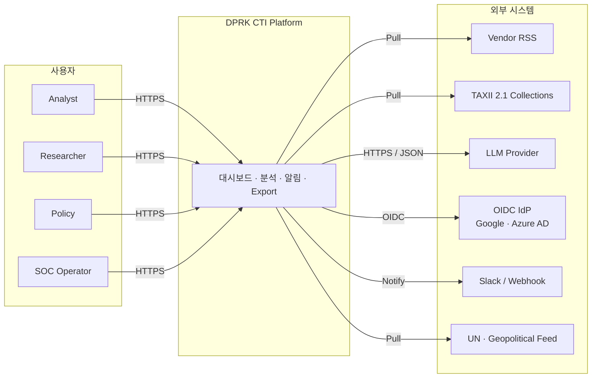
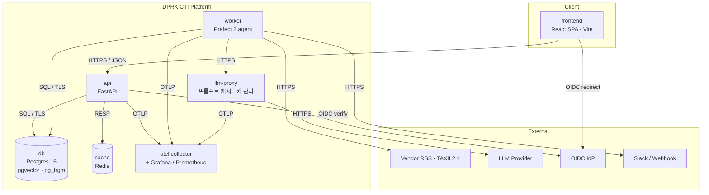
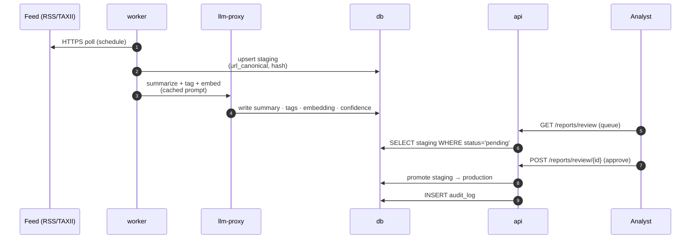
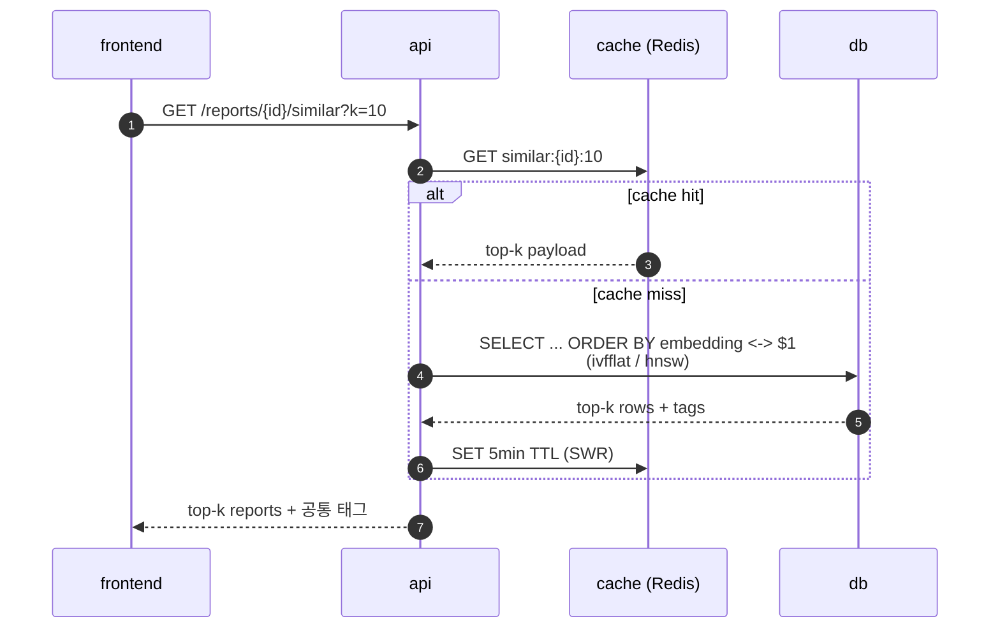
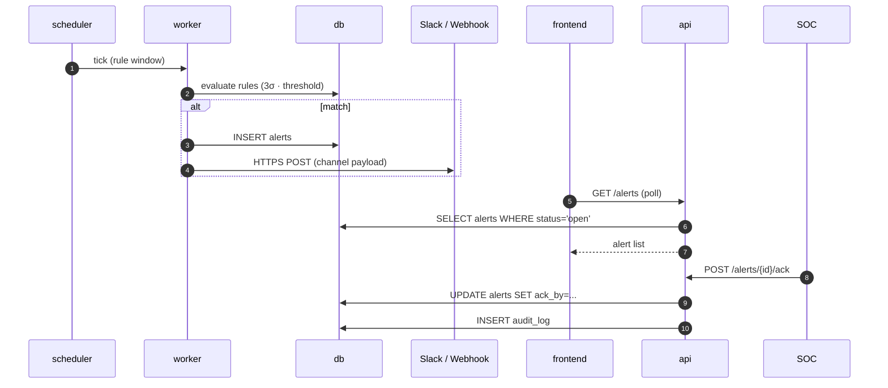
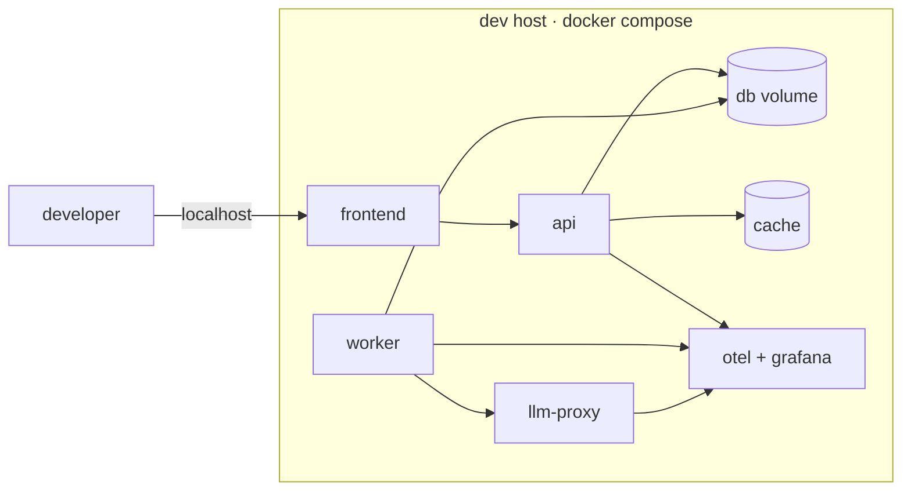
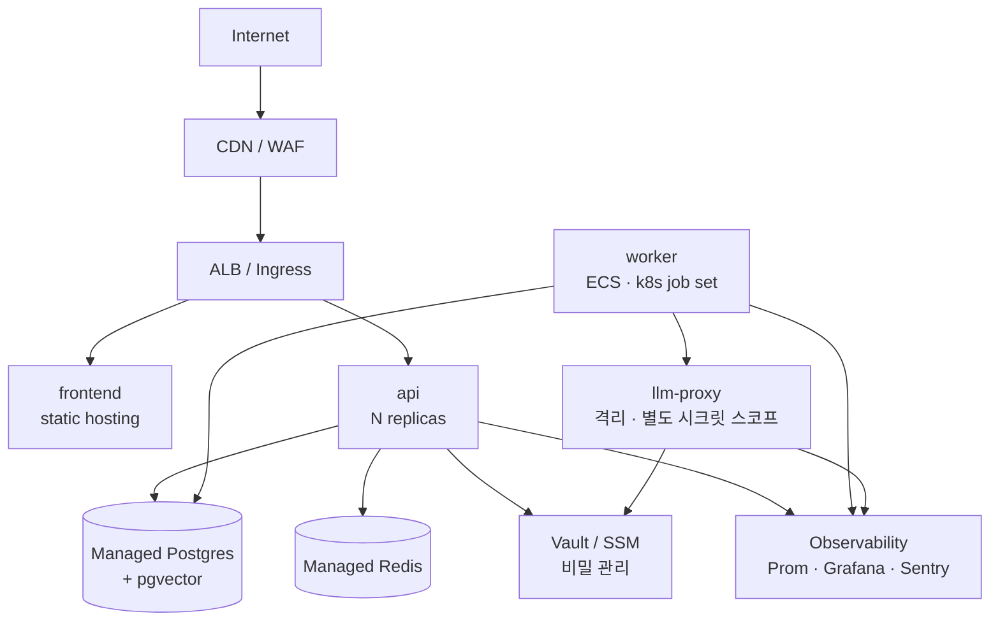

# DPRK Cyber Threat Intelligence Monitoring Platform

## 제품 설계서 (Product Design Specification) v2.0

**작성일:** 2026년 4월 13일
**이전 버전:** v1.0 (2026-04-13) — 단일 대시보드 설계
**기반 논문:** *An exploratory analysis of the DPRK cyber threat landscape using publicly available reports* (Lyu et al., 2025), International Journal of Information Security, 24:66

### v2.0 변경 요약

v1.0은 3개 엑셀 시트를 단일 대시보드로 시각화하는 설계였다. v2.0은 이를 **운영 가능한 CTI 플랫폼**으로 확장한다. 주요 변경점:

- **지식 모델**: STIX 2.1 네이티브 + MITRE ATT&CK 기법 매핑 + Admiralty/TLP 신뢰도 스코어링
- **자동화 파이프라인**: 벤더 RSS/TAXII 자동 수집 + LLM 보조 정규화 + 이상 탐지 알림
- **심화 분석**: 보고서 유사도(pgvector), 귀속 확률 그래프, 지정학 이벤트 오버레이
- **제품 품질**: OIDC/RBAC, 감사 로그, 관측성, i18n, STIX/PDF Export
- **신규 섹션**: 위협 모델(§10), 데이터 거버넌스(§11), KPI·성공지표(§15), 리스크 레지스터(§16)

---

## 1. 제품 개요 (Product Overview)

### 1.1 배경 및 목적

북한 국가 후원 사이버 위협 행위자는 2009–2024년 동안 전 세계 63개국에 걸쳐 154건의 주요 사건을 일으킨 글로벌 위협 세력이다. Lyu et al.(2025)은 2,058건 이상의 공개 보고서를 수집·분석하여 160개 코드명을 7개 그룹으로 클러스터링했으며, 추정 피해액은 $3.6B+에 달한다.

본 플랫폼은 (a) 해당 연구 데이터셋을 정규화된 지식 그래프로 변환하고, (b) 공개 출처(OSINT)에서 신규 보고서를 실시간으로 수집·통합하며, (c) CTI 분석가·연구자·정책 결정자가 공통의 운영 인텔리전스 표면(operational surface)에서 협업할 수 있도록 한다.

### 1.2 제품 비전

> **"북한 사이버 위협을 관찰·분석·예측·전파하는 단일 오픈소스 기반 CTI 워크벤치"**

v1.0이 *시각화 대시보드*였다면, v2.0은 *데이터 수집 → 정규화 → 분석 → 공유(STIX/PDF)* 의 end-to-end 워크벤치이다.

### 1.3 범위 (In/Out of Scope)

| 구분 | 포함 | 제외 |
|:---|:---|:---|
| **In Scope** | 공개 보고서(OSINT), 논문 데이터셋, 벤더 RSS/TAXII 피드, MITRE ATT&CK 매핑, STIX 2.1 import/export | 내부망 센서 텔레메트리, 라이브 C2 추적, 악성코드 리버싱 |
| **신뢰 수준** | TLP:WHITE / TLP:GREEN 출처 중심 (기본값) | TLP:AMBER/RED 데이터 처리는 Phase 4 옵션 |
| **재배포** | 출처·저작권 표기 및 snippet 인용만 허용 | 보고서 전문 재배포 금지 |

### 1.4 대상 사용자 · 페르소나

| 페르소나 | 역할(RBAC) | 핵심 Job-to-be-Done | 주요 기능 |
|:---|:---|:---|:---|
| **Aria — CTI 분석가** | `analyst` | 신규 위협 행위자의 귀속 및 캠페인 맵핑 | 코드명 네트워크, 태그 교차분석, 유사 보고서, STIX export |
| **Ben — 보안 연구원** | `researcher` | 학술·트렌드 연구, 데이터 재사용 | 시계열 분석, 쿼리 빌더, CSV 내보내기, reproducible notebooks |
| **Carol — 정책 결정자** | `policy` | 브리핑·제재 근거 자료 | KPI 카드, 세계지도, PDF 브리핑, 지정학 이벤트 오버레이 |
| **Dan — CERT/SOC 당직** | `soc` | 신규 활동 조기 경보 | 핫존·이상 탐지 알림, Slack/webhook, 활동 피드 |

---

## 2. 데이터 및 지식 모델 (Data & Knowledge Model)

### 2.1 개념 모델 개요

v2.0은 관계형 DB(PostgreSQL)와 STIX 2.1 객체 모델을 **양방향 매핑**한다. 모든 분석 fact는 최소 하나 이상의 `Report`를 근거(provenance)로 가진다.

```
Group (intrusion-set) ──┐
                        ├─ associated_with ──> CodeName (threat-actor alias)
Report ──references──── │                              │
  │                     └─ uses_ttp ──> Technique (attack-pattern)
  │
  └─ describes ──> Incident ──> Victim (identity)
                        ├─ targets_sector
                        ├─ targets_country
                        └─ motivation
```

### 2.2 핵심 엔티티 및 STIX 매핑

| 엔티티 | PostgreSQL 테이블 | STIX 2.1 타입 | 비고 |
|:---|:---|:---|:---|
| 그룹 | `groups` | `intrusion-set` | 7개 그룹 + MITRE intrusion-set ID |
| 코드명 | `codenames` (구 actors) | `threat-actor` 또는 alias | Named by CTI 벤더 포함 |
| 보고서 | `reports` | `report` | URL, 저자, TLP, 신뢰도 |
| 사건 | `incidents` | `campaign` 또는 `x-dprk-incident` (custom) | 복수 국가·섹터·동기 |
| 기법 | `techniques` | `attack-pattern` | MITRE Txxxx.xxx |
| 악성코드 | `malware` | `malware` | 논문 Tags에서 추출 |
| CVE | `vulnerabilities` | `vulnerability` | Tags `#CVE-YYYY-NNNN` |
| 태그 | `tags` | — (정규화 전용) | 동의어·타입 분류 |
| 출처(Author) | `sources` | `identity` | 벤더·기관 |

### 2.3 Tags 파싱 규칙 (v1.0에서 명세 누락)

해시태그 문자열은 ETL 단계에서 다음 정규식으로 5종으로 분류한다:

| 타입 | 정규식 예시 | 매핑 대상 |
|:---|:---|:---|
| `actor` | `#(lazarus|kimsuky|bluenoroff|scarcruft|andariel|konni|apt37|apt38|...)` | `codenames.name` |
| `malware` | `#(appleseed|bluelight|rokrat|dtrack|wannacry|...)` | `malware.name` |
| `cve` | `#cve-\d{4}-\d{4,7}` | `vulnerabilities.cve_id` |
| `operation` | `#op[\s\-_](.+)` | `campaigns.name` |
| `sector` | `#(crypto|finance|defense|gov|media|...)` | `sectors.code` |

**동의어 사전(alias dictionary)** — `Lazarus ↔ HIDDEN COBRA ↔ Zinc ↔ Diamond Sleet` 등을 매핑. 사전은 YAML로 관리하며 버전 관리된다.

### 2.4 신뢰도 스코어링 (v1.0에서 부재)

모든 `report`와 그로부터 파생된 fact는 다음 점수를 가진다:

| 필드 | 스케일 | 정의 |
|:---|:---|:---|
| `tlp` | `WHITE | GREEN | AMBER | RED` | FIRST TLP 2.0 |
| `source_reliability` | `A–F` | Admiralty/NATO STANAG 2511 |
| `info_credibility` | `1–6` | 〃 |
| `attribution_confidence` | `low | medium | high` | MITRE/ODNI 가이드 |

집계 차트는 기본값 `≥ C3` 만 포함하되, 사용자가 토글로 완화 가능하다.

### 2.5 관계형 스키마 (확장)

```
groups            (id, name, mitre_intrusion_set_id, aka[], color, description)
codenames         (id, name, group_id, named_by_source_id, first_seen, last_seen,
                   aliases[], confidence, stix_id)
sources           (id, name, type, country, website, reliability_default)
reports           (id, published, source_id, title, url, url_canonical, sha256_title,
                   lang, tlp, reliability, credibility, summary, embedding vector(1536))
tags              (id, name, type, canonical_id)        -- canonical_id: 동의어 정규화
report_tags       (report_id, tag_id, confidence)
report_techniques (report_id, technique_id, confidence) -- MITRE ATT&CK 직접 매핑
report_codenames  (report_id, codename_id, confidence)
incidents         (id, reported, title, description, est_loss_usd, attribution_confidence)
incident_sources  (incident_id, report_id)              -- 사건 ↔ 근거 보고서
incident_motivations (incident_id, motivation)
incident_sectors     (incident_id, sector_code)
incident_countries   (incident_id, country_iso2)
techniques        (id, mitre_id, name, tactic, description)
malware           (id, name, type, mitre_id, aliases[])
vulnerabilities   (id, cve_id, cvss, published, description)
geopolitical_events (id, date, type, title, source_url)  -- UN 제재, 핵실험 등 E-1용
alerts            (id, created, rule_id, severity, payload_jsonb, acknowledged_by)
audit_log         (id, actor, action, entity, entity_id, timestamp, diff_jsonb)
```

인덱스: `reports.embedding` (ivfflat/hnsw), `reports(published)`, `reports.url_canonical UNIQUE`, `tags.name`, 전문검색 `reports USING GIN (tsvector)`.

---

## 3. 데이터 파이프라인 (Data Pipeline)

### 3.1 전체 플로우

```
┌─────────────┐   ┌──────────────┐   ┌──────────────┐   ┌──────────┐   ┌──────────┐
│ 엑셀(3시트) │──▶│  Bootstrap   │──▶│   Postgres   │◀──│   API    │◀──│ Frontend │
└─────────────┘   │     ETL      │   │  + pgvector  │   │  Layer   │   └──────────┘
                  └──────────────┘   └──────▲───────┘   └────▲─────┘
┌─────────────┐   ┌──────────────┐          │                │
│ 벤더 RSS/   │──▶│  Ingest      │──────────┘                │
│ TAXII 2.1   │   │  Workers     │                           │
└─────────────┘   │ (Prefect)    │   ┌──────────────┐        │
                  └──────┬───────┘   │  LLM Enrich  │◀───────┤
                         └──────────▶│  (tag/summ/  │        │
                                     │  attribution)│        │
                                     └──────┬───────┘        │
                                            ▼                │
                                     ┌──────────────┐        │
                                     │  Anomaly &   │────────┘
                                     │  Alert Rules │
                                     └──────────────┘
```

> 상세 컨테이너 구성과 프로토콜 레이블은 §7.2 컨테이너 뷰를 참조한다.

### 3.2 Bootstrap ETL (v1.0 시트 → DB)

- **Phase 1 Week 1–2**: `openpyxl` + `pandas`로 3시트 로드, pydantic 스키마 검증, 동의어 사전 적용, `url_canonical`·`sha256_title` 산출, `tags` 정규화.
- **멱등성(idempotency)**: `url_canonical` UNIQUE + upsert. 재실행 안전.
- **데이터 품질 테스트**: pytest + SQL 기반 게이트 — null 비율, 값 도메인, 참조 무결성, 연도 범위, 중복률. CI에서 실행.

> **Errata 2026-04-15 (D1 substitution)**: v2.0 초안이 가리킨 Great Expectations는 Phase 1.2 구현(PR #7)에서 pytest + SQL 기반 게이트로 대체되었다. 대체 사유는 Great Expectations의 트랜시티브 의존성 규모(~200 MB), YAML suite fragmentation, Great Expectations의 async Postgres 통합 비용이다. 검사 셋(11개 expectation, 2-레벨 severity) 및 CI 차단 정책은 설계서 의도 그대로 유지된다. 전체 결정 기록(D1–D13)과 구현 계약은 `docs/plans/pr7-data-quality.md` 참조.
- **리니지(lineage)**: `audit_log`에 row-level 삽입 이력 기록.

### 3.3 실시간 수집 Workers

| 소스 유형 | 구현 | 주기 | 비고 |
|:---|:---|:---|:---|
| RSS/Atom | `feedparser` 기반 폴링 | 15분 | Ahnlab, EST, Kaspersky, Mandiant, Recorded Future 등 |
| TAXII 2.1 | `taxii2-client` | 30분 | 공개 컬렉션 (MITRE, OASIS) |
| HTML 크롤 | `httpx` + `selectolax` + robots.txt 준수 | 1시간 | 벤더 블로그 백필 |
| Telegram/X | 공식 API 또는 RSS 브릿지 | 30분 | 선택적, TLP 고려 |

Worker는 Prefect(또는 Airflow) 플로우로 관리되며, 실패 시 지수 백오프 재시도·DLQ(dead letter queue)를 사용한다. 수집된 보고서는 **Staging → Human Review → Production** 3단계 게이트를 거친다(기본값: `researcher` 이상의 승인 필요, 자동 승인은 설정 가능).

> **PR #8 errata (2026-04-16).** §14 W4의 "RSS/TAXII 수집 Worker"는 2개 PR로 분할 구현됨. **PR #8**: RSS/Atom만 (`feedparser` + `httpx`), staging 테이블 write-only, Prefect @flow 장식만 (deployment/schedule 미포함). **PR #9**: TAXII 2.1 (`taxii2-client`). RSS 구현의 D-decision 전문은 `docs/plans/pr8-rss-ingest.md`에 있다. HTTP fetch와 feed XML parse를 분리하여 `httpx`가 네트워크, `feedparser.parse(bytes)`가 파싱을 담당한다 — `feedparser.parse(url)` 형태의 네트워크 내장 호출은 금지. Feed runtime state (ETag, Last-Modified, 연속 실패 카운터)는 `rss_feed_state` 테이블에 저장하며 `sources` 테이블과 분리된다 (feed 수명과 CTI source entity 수명이 다르기 때문).

### 3.4 LLM 보조 정규화

| 작업 | 입력 | 출력 | 모델 정책 |
|:---|:---|:---|:---|
| 요약 | 보고서 본문/HTML | 3–5문장 한/영 요약 | Haiku(비용) |
| 태그 추천 | 본문 | 태그 후보 + confidence | Haiku |
| 그룹 귀속 제안 | 본문 + 기존 fact | `{group_id, confidence, evidence}` | Sonnet |
| Embedding | 제목+요약 | 1536-d 벡터 | `text-embedding-3-large` 또는 동급 |

**프롬프트 캐싱 필수** — 동의어 사전, ATT&CK 기법 카탈로그, 예시 보고서를 system 프롬프트로 캐시. 모든 LLM 출력은 `confidence < 0.7` 시 human review 큐로 전송.

### 3.5 이상 탐지 및 알림

| 규칙 ID | 조건 | 심각도 |
|:---|:---|:---|
| `HOT-ZONE-SPIKE` | 국가×28일 창 사건 수가 기준선의 3σ 초과 | HIGH |
| `NEW-CODENAME` | 7일 내 기존 사전에 없는 새 코드명 등장 | MEDIUM |
| `SECTOR-SURGE` | 섹터별 보고서 발간량 월 대비 +200% | MEDIUM |
| `HIGH-CRED-INCIDENT` | `reliability ≤ B` & `credibility ≤ 2` 신규 사건 | HIGH |
| `CVE-WEAPONIZATION` | 북한 태그 + CVE 동시 출현(공출현 그래프) | HIGH |

알림은 Slack·webhook·이메일로 전송되며, UI `alerts` 패널에 누적. `acknowledged_by` 필드로 SOC 당직 워크플로우 추적.

---

## 4. 대시보드 레이아웃 (Dashboard Layout)

### 4.1 전체 구조

상단 네비게이션 · KPI 카드 · 메인 뷰(지도 + 우측 패널) · 하단 패널 · **우측 플로팅 Alerts Drawer**의 5단 구조. v1.0 대비 **Alerts Drawer**와 **Command Palette(⌘K)** 가 추가된다.

### 4.2 ASCII 와이어프레임 (v2.0)

```
┌───────────────────────────────────────────────────────────────────────┐
│ [A] 타이틀 / 기간선택 / 그룹필터 / TLP필터 / 🔔 알림 / 👤 사용자 / ⌘K │
├───────────────────────────────────────────────────────────────────────┤
│ [B] KPI: Reports │ Actors │ Incidents │ Est.$ │ Peak │ Open Alerts   │
├──────────────────────────────────────────────────┬────────────────────┤
│                                                  │ [D] Motivation     │
│  [C] 세계지도 (Choropleth + Bubble)              │     Donut          │
│      + 지정학 이벤트 타임라인 오버레이            ├────────────────────┤
│      + TLP/신뢰도 필터                            │ [D] Sector Bar     │
│                                                  ├────────────────────┤
│                                                  │ [D] ATT&CK Heatmap │
├─────────────┬────────────┬────────────┬──────────┴────────────────────┤
│ [E] Annual  │ [E] Groups │ [E] Recent │ [E] Similar Reports (pgvector)│
│ Trend (dual)│ (7 cards)  │ Activity   │  (선택한 보고서 기준 유사도)   │
└─────────────┴────────────┴────────────┴───────────────────────────────┘
                                                   ┌────────────────────┐
                                                   │ [F] Alerts Drawer  │
                                                   │  (플로팅, 토글)    │
                                                   └────────────────────┘
```

### 4.3 영역별 레이아웃 그리드

| 영역 | 컴포넌트 | 우선순위 | v1.0 대비 변경 |
|:---|:---|:---:|:---|
| A | 네비게이션 + TLP 필터 + 알림 벨 + Command Palette | P0 | +TLP, +알림, +⌘K |
| B | KPI 카드 6개 (Open Alerts 신설) | P0 | +1 카드 |
| C | 세계지도 + 지정학 이벤트 오버레이 | P0 | +이벤트 오버레이 |
| D | 동기 도넛 + 섹터 바 + **ATT&CK Heatmap** | P0 | +ATT&CK |
| E | 트렌드 + 그룹 + 피드 + **Similar Reports** | P0 | +유사도 패널 |
| F | **Alerts Drawer (플로팅)** | P1 | 신규 |

---

## 5. 컴포넌트 상세 설계 (Component Specifications)

v1.0의 [A]–[E]는 유지하되 다음 항목을 보강·추가한다.

### 5.1 [A] 상단 네비게이션 (변경)

- **TLP 필터**: WHITE/GREEN/AMBER 체크박스. 기본 WHITE+GREEN.
- **신뢰도 필터**: `≥ C3` 기본. 슬라이더로 완화 가능.
- **알림 벨**: 미확인 알림 카운트 배지, 클릭 시 Alerts Drawer 토글.
- **Command Palette (⌘K)**: 전역 검색(보고서·코드명·사건), 액션(export·필터 리셋), 키보드 단축키 힌트.
- **사용자 메뉴**: 역할 배지(analyst/researcher/policy/soc), 로그아웃, 테마 토글.

### 5.2 [B] KPI 카드 (+1)

v1.0의 5개 카드에 **Open Alerts**(미확인 알림 수, 7일 신규 알림 추이 sparkline) 카드를 추가한다.

### 5.3 [C] 세계지도 (확장)

- v1.0 버블/색상/핫존 유지.
- **지정학 이벤트 오버레이**: 하단 타임라인에 UN 제재·미사일 발사·핵실험 핀. 연도 클릭 시 지도와 연동.
- **시간 슬라이더** 재생/일시정지, 속도 조절.
- **TLP 배지**: 버블 테두리 색으로 TLP 표시.

### 5.4 [D] ATT&CK Heatmap (신규)

MITRE ATT&CK Enterprise 매트릭스(14 tactic × ~200 techniques)를 히트맵으로 표시한다. 각 셀의 강도는 해당 기법이 언급된 보고서 수(기간·그룹 필터 적용). 셀 클릭 시 근거 보고서 목록 드릴다운. Navigator JSON export 지원.

### 5.5 [E] Similar Reports (신규)

사용자가 피드에서 보고서를 선택하면 `pgvector` 코사인 유사도 Top-10을 우측 패널에 표시. 유사도 점수 + 공통 태그 강조. **중복 캠페인 탐지**에 사용.

### 5.6 [F] Alerts Drawer (신규)

우측 슬라이드 패널. 규칙별 최근 알림 목록, 확인/무시/에스컬레이션 액션, Slack/webhook 재전송, 알림 → 사건 링크 생성.

---

## 6. 분석 기능 (Analysis Features)

v1.0의 15개 기능을 유지하고, v2.0에서 다음 7개 기능을 추가한다(누적 22개).

### 6.1 추가 기능

| ID | 분석 기능 | 상세 | 데이터 |
|:---:|:---|:---|:---|
| **F-1** | 보고서 유사도 검색 | `pgvector`로 선택 보고서의 Top-k 유사 문서. 중복 캠페인·포크 보고서 탐지 | `reports.embedding` |
| **F-2** | 귀속 확률 그래프 | codename↔group 엣지 가중치 = 근거 보고서 수×신뢰도. 불확실 귀속 하이라이트 | `report_codenames` + `confidence` |
| **F-3** | ATT&CK 기법 프로파일 | 그룹별 Top 기법, 시간 경과 변화(TTP 진화 구체화) | `report_techniques` |
| **F-4** | 지정학 이벤트 상관 | UN 제재/핵실험 ±30일 창 보고서·사건 급증 여부 통계 검정 | `geopolitical_events` + `reports` |
| **F-5** | CVE 무기화 추적 | 북한 태그 + CVE 공출현 그래프, CVE별 최초 언급일·CVSS | `vulnerabilities` + `report_tags` |
| **F-6** | 예측(단기) | Prophet/ARIMA로 연·월간 보고서·사건 예측(90% CI) | 시계열 집계 |
| **F-7** | Human-in-the-loop 리뷰 | LLM 제안 태그·귀속을 승인/거절하는 큐. 거절은 모델 교정에 피드백 | `reports` staging |

### 6.2 v1.0 기능 구체화

- **A-1 코드명 네트워크**: Force-directed + 커뮤니티 검출(Louvain) 옵션. 노드 우클릭 → 근거 보고서.
- **D-1 상관분석**: Pearson + Spearman + lag cross-correlation(±24개월). 통계 검정 p-값 표시.
- **E-1 지정학 연계**: F-4와 통합, 외부 이벤트 피드 자동 수집.
- **E-2 TTP 진화**: F-3 기반, ATT&CK Navigator JSON 내보내기.

---

## 7. 기술 스택 및 아키텍처 (Technical Architecture)

### 7.1 아키텍처 개요 (C4 System Context)

플랫폼은 분석가·연구자·정책 담당·SOC 오퍼레이터가 DPRK 사이버 위협 정보를 수집·정규화·분석·공유하도록 지원하는 단일 시스템이다. 외부 경계에는 벤더 RSS / TAXII 2.1 피드, LLM 제공자, OIDC IdP, Slack/웹훅, UN·지정학 이벤트 피드가 위치한다. §1.4 페르소나 및 §3.1 파이프라인의 상위 뷰에 해당한다.



### 7.2 컨테이너 뷰 (C4 L2)

런타임 컨테이너와 프로토콜 레이블. 컨테이너 이름은 §7.5 스택 표와 §9.1 트러스트 경계에 표현된 요소들과 1:1 대응한다.



v1.0의 평면 서비스 목록(frontend / api / worker / llm-proxy / db / cache / otel / grafana)은 이 다이어그램으로 대체된다.

### 7.3 런타임 시나리오

세 가지 핵심 경로를 sequence diagram으로 고정한다.

**(1) RSS 수집 → Staging → Human Review → Production** — §3.3 · §3.4 · §6.1 F-7 대응.



**(2) Similar Reports 쿼리 (pgvector kNN + 캐시)** — §5.5 · §6.1 F-1 · §7.6 엔드포인트 대응.



**(3) Anomaly Rule → Alert → Acknowledge** — §3.5 · §5.6 대응.



### 7.4 배포 토폴로지

**개발 환경 — Docker Compose (단일 호스트)**



**운영 환경 — Terraform · 관리형 서비스**



배포는 GitHub Actions + OIDC로 수행하며(§9.5), 모든 비밀은 Vault/SSM에서 런타임 주입한다(§9.4). `llm-proxy`는 독립된 시크릿 스코프와 네트워크 egress 정책을 가진다.

### 7.5 기술 스택 (v1.0 대비 변경점 **굵게**)

| 계층 | 기술 | 비고 |
|:---|:---|:---|
| Frontend | React 18 + TypeScript + Vite | — |
| UI Kit | **shadcn/ui + Tailwind CSS** | 접근성 기본 |
| 시각화 | D3.js + Recharts + **visx** | heatmap/network 보강 |
| 지도 | D3-geo + TopoJSON (pre-quantized) | — |
| 상태관리 | Zustand + TanStack Query | — |
| Backend | **FastAPI (Python 3.12)** | ML 생태계 근접 |
| Workers | **Prefect 2** | ETL · 수집 · LLM 플로우 |
| DB | **PostgreSQL 16 + pgvector + pg_trgm** | 임베딩 · 전문검색 |
| Cache | **Redis** | aggregate 캐시, rate-limit |
| Auth | **Authlib (OIDC)** + JWT | Google/Azure AD |
| Observability | **OpenTelemetry + Prometheus + Grafana + Sentry** | — |
| CI/CD | **GitHub Actions + Docker + pre-commit** | lint·type·test 게이트 |
| IaC | **Docker Compose (dev) / Terraform (prod)** | — |

### 7.6 API 엔드포인트 (v2.0 추가분)

v1.0의 15개 엔드포인트를 유지하고 다음을 추가한다:

```
# Authentication
POST /api/v1/auth/login                    OIDC 콜백
GET  /api/v1/auth/me                       현재 사용자/역할

# Realtime ingestion
POST /api/v1/ingest/rss/run                수집 트리거 (admin)
GET  /api/v1/ingest/status                 최근 실행 이력
POST /api/v1/reports/review/{id}           human-review 승인/거절

# Similarity & analytics
GET  /api/v1/reports/{id}/similar?k=10     pgvector Top-k
GET  /api/v1/analytics/attack-heatmap      ATT&CK 기법 × 그룹 집계
GET  /api/v1/analytics/attribution-graph   codename↔group 확률 엣지
GET  /api/v1/analytics/geopolitical        UN/이벤트 상관 통계
GET  /api/v1/analytics/forecast?metric=... Prophet 결과
GET  /api/v1/search?q=...                  전문검색 + 벡터 하이브리드

# Alerts
GET  /api/v1/alerts                        목록
POST /api/v1/alerts/{id}/ack               확인
POST /api/v1/alerts/rules                  규칙 CRUD (admin)

# Export
GET  /api/v1/export/stix?filter=...        STIX 2.1 bundle
GET  /api/v1/export/pdf?template=briefing  정책 브리핑 PDF
GET  /api/v1/export/csv?entity=reports     CSV
```

모든 엔드포인트는 OpenAPI 3.1 스펙으로 문서화되며, Pact 계약 테스트로 프론트/백엔드 호환성을 검증한다.

### 7.7 성능 전략

- **Materialized Views**: `mv_year_group_sector`, `mv_country_motivation_year` 등. Prefect가 야간 재계산.
- **Redis 캐시**: aggregate 응답 5분 TTL, `stale-while-revalidate`.
- **지도 토폴로지**: TopoJSON pre-quantization, 국가 경계 간소화.
- **프론트 가상화**: 보고서 목록 virtualized list(10k+ 행).
- **p95 목표**: `/api/v1/dashboard/summary` ≤ 300 ms, `/api/v1/reports/{id}/similar` ≤ 500 ms.

---

## 8. UX 인터랙션 · 접근성 · i18n

### 8.1 필터 연동 및 URL State

모든 필터는 URL query string에 직렬화된다(공유·북마크 가능). 예:
`/?from=2018&to=2024&groups=lazarus,kimsuky&tlp=WHITE&sector=crypto`

### 8.2 Command Palette

`⌘K` / `Ctrl+K`로 호출. 전역 검색(보고서·코드명·사건·알림), 액션(export, 필터 리셋, 테마 토글), 최근 항목, 키보드 단축키 치트시트.

### 8.3 접근성 (WCAG 2.1 AA)

- 모든 차트에 텍스트 대체(데이터 테이블 토글).
- 색상만으로 정보 전달 금지(패턴·아이콘 병행).
- 키보드 전용 내비게이션 경로 보장.
- 명도 대비 ≥ 4.5:1, 포커스 링 가시성.
- `prefers-reduced-motion` 존중(지도 애니메이션 off).

### 8.4 i18n

- 기본: 한국어(ko), 보조: 영어(en).
- `react-i18next`, 논문 고유명사 이중 표기(Lazarus/라자루스).
- 날짜·숫자 포매팅 ICU.

### 8.5 다크/라이트 모드

- SOC 환경 기본 다크, OS 설정 존중.
- 색맹 친화 팔레트(Okabe–Ito) 토글.

---

## 9. 보안 · 위협 모델 (Security & Threat Model)

### 9.1 Trust Boundaries

```
Internet ──▶ CDN/WAF ──▶ Frontend ──▶ API ──▶ DB
                                │
                                └──▶ Worker ──▶ External Feeds / LLM
```

> 전체 트러스트 경계는 §7.2 컨테이너 뷰에 프로토콜 레이블과 함께 표현되어 있다.

### 9.2 위협 모델 (STRIDE 요약)

| 카테고리 | 시나리오 | 완화 |
|:---|:---|:---|
| Spoofing | OIDC 토큰 탈취 | 짧은 만료 + refresh 회전 + device binding |
| Tampering | 수집 피드 MITM | HTTPS 강제 + 공개키 핀(가능한 경우) + 서명 검증(TAXII) |
| Repudiation | 분석가 조작 추적 불가 | `audit_log` 모든 mutation + append-only |
| Info Disclosure | TLP 경계 위반 | Row-level security by `tlp` × `role` |
| DoS | 수집 피드 폭주 | rate limit + DLQ + 백오프 |
| Elevation | API 권한 상승 | RBAC 미들웨어 + OpenAPI 스펙 레벨 scope 검사 |

### 9.3 RBAC 역할 매트릭스

| 액션 | analyst | researcher | policy | soc | admin |
|:---|:---:|:---:|:---:|:---:|:---:|
| View WHITE/GREEN | ✓ | ✓ | ✓ | ✓ | ✓ |
| View AMBER | ✓ | — | — | ✓ | ✓ |
| Human review 승인 | ✓ | ✓ | — | — | ✓ |
| Alerts ack | ✓ | — | — | ✓ | ✓ |
| Alert 규칙 CRUD | — | — | — | — | ✓ |
| STIX export | ✓ | ✓ | ✓ | ✓ | ✓ |
| User 관리 | — | — | — | — | ✓ |

### 9.4 비밀·자격 관리

- 모든 비밀은 `.env` 금지, **Vault 또는 AWS SSM**.
- LLM 키는 `llm-proxy`만 접근.
- 의존성 스캔(Trivy, pip-audit, npm audit) CI.
- SCA·SAST(Semgrep) 게이트.

### 9.5 공급망

- 베이스 이미지 pin + SBOM(Syft) 자동 생성.
- GitHub Actions OIDC로 배포(장기 credential 없음).

---

## 10. 데이터 거버넌스 · 라이선스

### 10.1 원칙

- 수집하는 보고서는 **저작권이 있는 저작물**. 본 플랫폼은 **메타데이터·요약·인용**만 저장·표시하며, 본문 전문은 저장하지 않는다.
- 각 보고서 원문은 **URL로 연결**하며, 제3자 벤더의 robots.txt 및 이용약관을 준수.
- TLP 2.0 사용, 재공유 규칙 자동 표시.

### 10.2 DPIA 고려사항

- 개인정보(피해자 이름)는 **공개 보고서에 이미 공개된 경우에만** 저장, 내부 정책에 따라 pseudonymization 옵션 제공.
- 북한 관련 제재 준수(OFAC/EU) — 지갑 주소 등 제재 리스트 교차 확인.

### 10.3 데이터 리텐션

- `reports`: 무기한(메타데이터).
- `audit_log`: 2년.
- `alerts`: 1년.
- `staging` 큐: 30일 후 자동 purge(승인되지 않은 항목).

---

## 11. 관측성 · 운영 (Observability & Operations)

| 계층 | 도구 | 수집 지표 |
|:---|:---|:---|
| Metrics | Prometheus | 요청수/에러율/지연, DB connections, LLM 토큰 사용량, 수집 성공률 |
| Traces | OTel + Tempo/Jaeger | end-to-end latency, DB 쿼리 |
| Logs | Loki (structured JSON) | 애플리케이션 + worker |
| Errors | Sentry | 프론트 + 백엔드 |
| Uptime | 외부 probe | `/healthz`, `/readyz` |
| Dashboards | Grafana | 4개 보드: API/Worker/LLM/Product KPI |

**SLO 예시**: API 가용성 99.5% / 월, p95 지연 ≤ 500 ms, 수집 파이프라인 성공률 ≥ 98%.

---

## 12. 테스트 · 품질 전략

| 레벨 | 도구 | 커버리지 목표 |
|:---|:---|:---:|
| Unit (backend) | pytest + hypothesis | ≥ 85% |
| Unit (frontend) | Vitest + React Testing Library | ≥ 80% |
| 계약 | Pact | 전체 API |
| Data quality | pytest + SQL gate (§3.2 errata) | 전체 테이블 |
| E2E | Playwright | 10개 핵심 플로우 |
| 시각 회귀 | Playwright + pixelmatch | KPI·지도·차트 |
| Load | k6 | 동시 100, p95 ≤ 500 ms |
| Security | Semgrep, Trivy, OWASP ZAP | CI 게이트 |

CI 게이트: lint → type → unit → 계약 → 데이터 품질 → E2E → security. 실패 시 머지 차단.

---

## 13. UX 인터랙션 세부 (v1.0 §6 확장)

v1.0 §6 클릭-스루 탐색을 유지하고 다음 추가:

| 트리거 | 결과 |
|:---|:---|
| ATT&CK Heatmap 셀 클릭 | 기법 프로파일 모달 (근거 보고서·그룹·타임라인) |
| Alerts Drawer 항목 | 상세 패널(원인 데이터, 링크된 보고서, Ack/Escalate) |
| Similar Reports 항목 | 보고서 상세 + 태그 diff |
| URL 공유 버튼 | 현재 필터 상태를 복사 가능한 링크 |
| `⌘K` | Command Palette |
| `?` | 키보드 단축키 시트 |

---

## 14. 개발 로드맵 (Development Roadmap v2.0)

병렬 워크스트림 방식으로 재구성. 팀 구성: FE 2 + BE 2 + Data/ML 1 + Design 1.

### Phase 1 — Foundation (5주)

- **W1**: 저장소 부트스트랩, CI/CD, Docker Compose, OIDC 스캐폴딩, 관측성 기본.
- **W2**: DB 스키마 · pgvector · Alembic 마이그레이션, Bootstrap ETL(시트 → DB), 동의어 사전.
- **W3**: 데이터 품질 게이트(pytest + SQL, §3.2 errata), 감사 로그, audit 기본.
- **W4**: RSS/TAXII 수집 Worker (Prefect 플로우), Staging → Review 큐. *(PR #8 errata: RSS=PR #8, TAXII=PR #9로 분할. §3.3 errata 참조.)*
- **W5**: 핵심 API(summary, reports, incidents, actors), OpenAPI 계약, Pact 베이스라인.

### Phase 2 — Core Dashboard (6주) *(FE 워크스트림)*

병렬: Phase 1 W3부터 착수.
- **W1–2**: 레이아웃, 상단바(필터+TLP+⌘K), KPI 카드, 테마.
- **W3–4**: D3 세계지도 + 지정학 이벤트 오버레이 + 시간 슬라이더.
- **W5**: 동기/섹터/ATT&CK Heatmap, 하단 패널(트렌드·그룹·피드).
- **W6**: Command Palette, URL state, i18n ko/en, 접근성 감사.

### Phase 3 — Analytics Depth (4주)

- **W1**: A-1 네트워크 + F-2 귀속 확률 그래프.
- **W2**: D-1 상관분석(lag) + F-4 지정학 상관.
- **W3**: F-1 유사도(pgvector) + F-5 CVE 무기화.
- **W4**: 상세 모달들, 드릴다운, 사건-보고서 양방향 링크.

### Phase 4 — Intelligence Automation (4주)

- **W1**: LLM 보조 정규화(요약·태그·귀속) + human review UI.
- **W2**: 이상 탐지 규칙 엔진 + Alerts Drawer + Slack/webhook.
- **W3**: F-6 Prophet 예측 + ATT&CK Navigator export.
- **W4**: 성능 최적화(materialized views, Redis), p95 튜닝.

### Phase 5 — Share & Pilot (3주)

- **W1**: STIX 2.1 Export, PDF 브리핑 템플릿(policy 역할).
- **W2**: 외부 베타 파일럿(2–3개 팀), 피드백 수집.
- **W3**: GA 릴리스, 문서, 런북, 백필 수집.

**총 기간**: 약 17–18주(일부 Phase 병렬).

### 14.1 마일스톤 및 Exit Criteria

| 마일스톤 | Exit 기준 |
|:---|:---|
| M1 (Phase 1 종료) | 시트 100% 임포트, 데이터 품질 테스트 green, OIDC 로그인 동작 |
| M2 (Phase 2 종료) | 5개 핵심 뷰 동작, Lighthouse ≥ 90, a11y 감사 통과 |
| M3 (Phase 3 종료) | 15개 분석 기능 중 18개 가용, p95 ≤ 500 ms |
| M4 (Phase 4 종료) | LLM 정규화 정밀도(샘플 100개) ≥ 0.8, 알림 규칙 5종 가동 |
| M5 (GA) | 베타 NPS ≥ 30, SLO 2주 연속 달성 |

---

## 15. KPI · 성공 지표 (Product KPIs)

| 영역 | 지표 | 목표 |
|:---|:---|:---|
| 사용 | WAU / MAU | 베타 50 / GA 200 |
| 신뢰 | 알림 precision (확인률) | ≥ 0.7 |
| 생산성 | 분석가당 브리핑 작성 시간 | -40% (대조군 대비) |
| 데이터 | 수집 커버리지 (등록 피드 대비) | ≥ 95% |
| 모델 | LLM 태그 recall / precision (샘플) | ≥ 0.8 / ≥ 0.85 |
| 품질 | 데이터 품질 테스트 pass rate | 100% |
| 운영 | API 가용성 / p95 | 99.5% / ≤ 500 ms |

---

## 16. 리스크 레지스터

| ID | 리스크 | 영향 | 확률 | 완화 |
|:---:|:---|:---:|:---:|:---|
| R1 | 저작권 분쟁(보고서 본문 저장) | H | L | 메타데이터+요약만, URL 연결, robots 준수 |
| R2 | LLM 귀속 오류로 잘못된 인텔 확산 | H | M | 신뢰도 임계값, human review, confidence 표시 |
| R3 | 데이터 편향(영어권 벤더 중심) | M | H | 언어 필터, 동아시아 벤더 가중치, 출처 다양성 KPI |
| R4 | TLP 경계 위반 (AMBER 누출) | H | L | Row-level security, 역할 테스트 E2E |
| R5 | 수집 피드 장애로 인한 공백 | M | M | 다중 소스, DLQ, 결측 경보 |
| R6 | 제재 준수(OFAC) | H | L | 법무 리뷰, 지갑 주소 교차검사 |
| R7 | 성능 저하(데이터 성장) | M | M | Materialized views, 파티셔닝, 캐시 |
| R8 | 개발 지연(복합 기능) | M | M | 병렬 워크스트림, Phase 5 범위 조정 가능 |

---

## 17. 논문 인사이트 매핑 (Key Insights — v1.0 §8 확장)

v1.0의 매핑표를 유지하고 v2.0 기능을 추가 매핑:

| 논문 참조 | 내용 | v2.0 반영 |
|:---|:---|:---|
| Fig.2 | 연간 보고서 수 | E-Trend + F-6 예측 |
| Fig.3 | 주요 기여 기관 | B-2 + 출처 다양성 KPI |
| Fig.5 | 코드명 네트워크 | A-1 + F-2 귀속 그래프 |
| Fig.6 | 연간 사건 수 | E-Trend + F-6 |
| Fig.7 | 동기 비율 | [D] 도넛 + C-1 |
| Fig.8 | 금전적 동기 추이 | C-1 Stacked area |
| Fig.9 | 섹터 비율 | [D] 바 + F-3 |
| Fig.10 | 금융/암호화폐 추이 | C-2 + F-5 CVE |
| Table 2 | 7 그룹 × 160 코드명 | [E] 그룹 목록 + F-2 |
| Table 3 | 국가별 빈도 | [C] 지도 + F-4 지정학 |
| §Discussion 귀속 불확실성 | — | **F-2 신규 반영** |
| §Discussion 2015년 동기 전환 | — | **F-4 통계 검정** |

---

## 18. 부록 A — 색상 체계 (v1.0 유지 + 확장)

v1.0 부록 표를 유지하고 다음 추가:

| 용도 | 색상 | HEX | 비고 |
|:---|:---|:---:|:---|
| TLP:WHITE | 흰색 테두리 | `#FFFFFF` | FIRST TLP 2.0 |
| TLP:GREEN | `#33FF00` | — | |
| TLP:AMBER | `#FFC000` | — | |
| TLP:RED | `#FF2B2B` | — | |
| Alert HIGH | `#E24B4A` | — | |
| Alert MEDIUM | `#EF9F27` | — | |
| Alert LOW | `#888780` | — | |
| Okabe–Ito 팔레트 | — | — | 색맹 친화 토글 시 |

## 19. 부록 B — STIX 2.1 Export 예시

```json
{
  "type": "bundle",
  "id": "bundle--...",
  "objects": [
    { "type": "intrusion-set", "id": "intrusion-set--lazarus", "name": "Lazarus Group",
      "aliases": ["HIDDEN COBRA", "Zinc"] },
    { "type": "threat-actor", "id": "threat-actor--0001", "name": "APT38",
      "resource_level": "government" },
    { "type": "relationship", "relationship_type": "attributed-to",
      "source_ref": "threat-actor--0001", "target_ref": "intrusion-set--lazarus",
      "confidence": 85 },
    { "type": "report", "id": "report--...", "name": "Bangladesh Bank Heist Analysis",
      "published": "2016-03-15T00:00:00Z",
      "object_refs": ["intrusion-set--lazarus", "campaign--bangladesh-bank"],
      "external_references": [{ "source_name": "BAE Systems", "url": "https://..." }] }
  ]
}
```

## 20. 부록 C — MITRE ATT&CK 매핑 예시

| Tag (raw) | Technique ID | Tactic |
|:---|:---|:---|
| `#spearphish` | T1566.001 | Initial Access |
| `#appleseed` | S1024 (software) | — |
| `#dll-sideload` | T1574.002 | Defense Evasion |
| `#swift-heist` | T1537 (Transfer Data to Cloud) + custom | Exfiltration |

---

*End of Document — v2.0*
